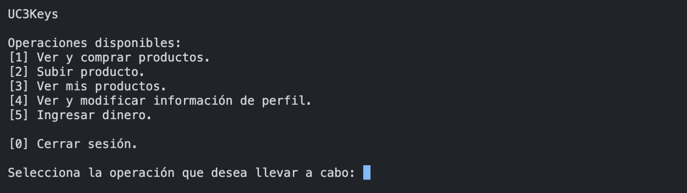
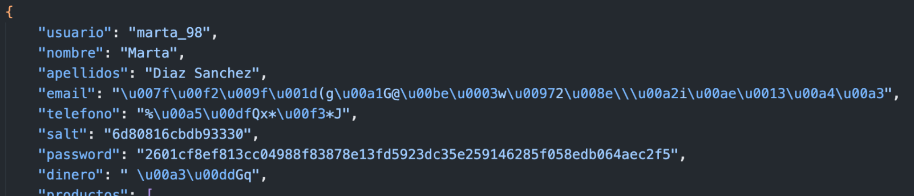
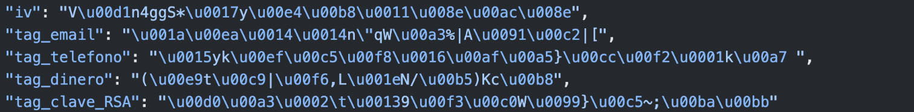
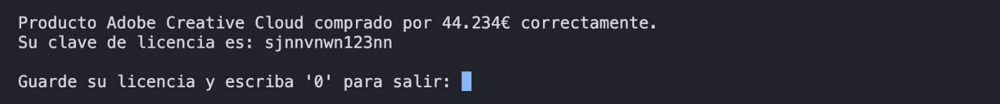
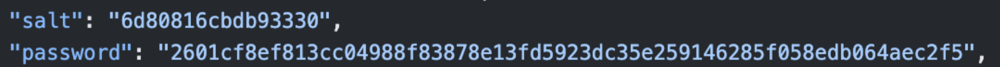
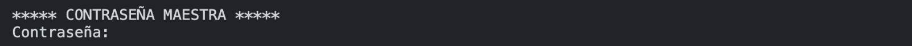
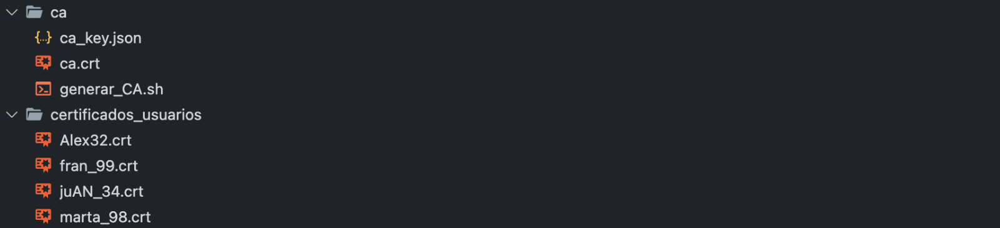
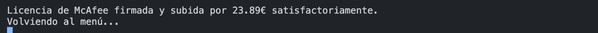
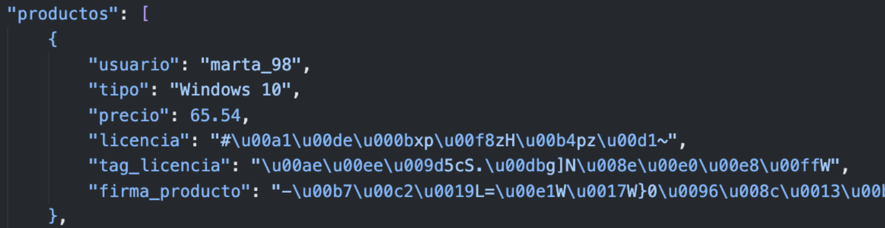

# 🔐 UC3Keys
La aplicación desarrollada ha sido llamada UC3Keys y consiste en un sistema de tienda de licencias de programas de software online en el que los usuarios pueden registrarse y vender licencias de software (productos) a otros usuarios. De esta forma, un usuario que está registrado puede subir distintos tipos de licencia a la plataforma, eliminarlas, ingresar dinero en la cuenta, comprar licencias de software de otros usuarios con ese dinero y modificar los datos de su perfil en caso de que sea necesario. El objetivo desde el principio ha sido realizar este comportamiento mediante la implementación de una aplicación base usando el lenguaje de programación Python con una interfaz guiada sencilla pero clara al usuario a la que posteriormente se le han aplicado procedimientos criptográficos de distintos tipos con el objetivo de que la aplicación cuente con cierta seguridad ante posibles ataques o usos indeseados. De esta forma, se mantiene la confidencialidad, integridad y disponibilidad en el sistema, siendo este totalmente seguro al tratar con datos sensibles tales como contraseñas de los usuarios, datos personales sensibles o las propias licencias que los usuarios pueden comprar. Es por esto que, en caso de ataque a la base de datos, el atacante no podrá obtener ningún datos que comprometa la privacidad de los usuarios que conforman la aplicación.

# Contenido
- [Funcionalidades](#funcionalidades)
- [Ejecución](#ejecución)
- [Consideraciones](#consideraciones)
- [Cifrado simétrico](#cifrado-simétrico)
  - [Cifrado y descifrado con AES-128](#cifrado-y-descifrado-con-aes-128)
- [Funciones hash o HMAC](#funciones-hash-o-hmac)
    - [Función resumen con SHA-256](#función-resumen-con-sha-256)
- [Autenticación](#autenticación)
    - [Infraestructura de Clave Pública (PKI)](#infraestructura-de-clave-pública-pki)
- [Firma digital](#firma-digital)
    - [Firma y verificación con RSA](#firma-y-verificación-con-rsa)
- [Mejoras realizadas](#mejoras-realizadas)
- [Conclusión](#conclusión)

# Funcionalidades
En cuanto a las funcionalidades, observamos las siguientes:
- El usuario puede **registrarse** en la aplicación incluyendo su nombre, apellidos, nombre de usuario, email, teléfono y contraseña. Estos campos del formulario están protegidos y cuentan con requisitos mínimos para garantizar tanto la seguridad del propio usuario como la prevención de funcionamientos indeseados en la base de datos o en el propio código fuente de la aplicación al tratar con estos datos.
- El usuario puede **iniciar sesión** con el nombre de usuario y la contraseña indicados en el formulario de registro. En caso de que el usuario no esté registrado en la aplicación, este no podrá acceder a la misma.
- Una vez que el usuario ha iniciado sesión, se mostrará un menú como el que se muestra a continuación: <br><br> <br><br> En él, se pueden seleccionar las siguientes opciones:
    - **Ver y comprar productos**: Se enumeran los productos que otros usuarios están vendiendo así como sus principales características (vendedor, tipo y precio). Además, se le da al usuario la posibilidad de comprarlos, siendo esta la principal funcionalidad de la aplicación y donde residen la mayoría de procedimientos criptográficos.
    - **Subir producto**: Se despliega una serie de campos que el usuario tiene que rellenar para poder subir un nuevo producto a la aplicación. Estos son: tipo de licencia (se despliega un menú con varias opciones preestablecidas), precio y número de licencia (producto).
    - **Ver mis productos**: Se enumeran los productos que el usuario está vendiendo junto con su precio. Para nuestro caso, no se considera la modificación de los mismos por parte del usuario pero sí se permite que el usuario elimine los mismos.
    - **Ver y modificar información de perfil**: Se muestra información del perfil del usuario que tiene la sesión iniciada. Además, se le permite al usuario modificar los datos de perfil atendiendo a las limitaciones marcadas al igual que cuando se realizó el registro.
    - **Ingresar dinero**: El usuario puede ingresar una cantidad de dinero que desee. En este caso, no hemos considerado intermediarios como bancos o similares, por lo que el usuario puede ingresar la cantidad arbitraria de dinero que quiera.
    - **Cerrar sesión**: La sesión del usuario finaliza y este es devuelto a la pantalla de inicio de sesión para volver a autenticarse.

# Ejecución

1. Instalar el paquete Cryptography de Python:
``` bash
pip install cryptography
```
2. Ejecutar la aplicación:
``` bash
python main.py
```
3. Ingresar la contraseña maestra '1234' para descifrar la clave privada de la CA.
4. Seguir las instrucciones que se muestran en pantalla.

# Consideraciones
- Las cantidades de dinero tienen que ser escritas utilizando punto ('.') como separador para los decimales (formato inglés) debido al tratamiento de los floats en el lenguaje Python.
- La aplicación contiene tiempos de espera entre acciones para prevenir al atacante de realizar operaciones de fuerza bruta y forzar la aplicación para alterar su funcionamiento normal.
- En general, se puede pulsar la tecla '0' para volver hacia atrás en los menús.
- En caso de error al rellenar formularios, se mostrarán los requisitos del campo concreto y tras 3 intentos se bloqueará el formulario por unos segundos.
- Para esta versión de la aplicación, el usuario puede ingresar dinero en su cuenta de manera infinita sin usar los datos bancarios para hacer la ejecución de la misma más simple.

Para que la aplicación funcione con esta base de datos preconfigurada, copiar el
contenido del archivo [registros_ejemplo.json](datos_ejemplo/registros_ejemplo.json) en el archivo registros.json. De esta
forma, la base de datos contará con los 4 usuarios descritos debajo los cuales
tienen dinero ingresado a su cuenta y productos de distintos tipos y precios para
poder ver el funcionamiento de la aplicación con varios usuarios registrados a la vez.
Además, se debe copiar el contenido de ca_ejemplo a la carpeta ca y el contenido de
certificados_usuarios_ejemplo a la carpeta certificados_usuarios.

Formato de los registros de la base de datos:
- (Usuario)
- (Nombre)
- (Apellidos)
- (Email)
- (Teléfono)
- (Contraseña)
- (Dinero)
- (Lista de productos)

------------------------------------------------------

- Alex32
- Alejandro
- Ramirez Vega
- alejandro-ramirez@gmail.com
- 628343932
- aleX*98d
- Dinero: 200€
- Productos:
    - 1 - Windows 10 - 45.54€ - 12983b98bsb23
    - 1 - Windows 10 - 12.3€ - 2839b8f91b2fas
    - 2 - Windows 11 - 120.4€ - asdno123bvas
    - 5 - Norton 360 - 50€ - i123on89sbdiub
    - 6 - McAfee - 23.89€ - asd231i23uvvnvn

------------------------------------------------------

- marta_98
- Marta
- Diaz Sanchez
- martita_98@outlook.com
- 762899323
- As1*88sw
- Dinero: 200€
- Productos:
    - 1 - Windows 10 - 65.54€ - 123b9c8b123b38
    - 2 - Windows 11 - 122.3€ - asjdn1iu2b31i2b3
    - 6 - McAfee - 20.42€ - aslkdi2n3nnnv
    - 6 - McAfee - 23.4€ - sajd23uuv9as9
    - 6 - McAfee - 28.82€ - 9823981b2v3x

------------------------------------------------------

- juAN_34
- Juan
- Perez Navarro
- juan.34@yahoo.es
- 623928374
- 399_Dh45
- Dinero: 200€
- Productos:
    - 3 - Microsoft 365 - 95.54€ - 9239b129b28ds
    - 3 - Microsoft 365 - 42.3€ - asjdi23i3i123
    - 5 - Norton 360 - 72.4€ - skkskskk123i
    - 6 - McAfee - 19.234€ - 120399v9vsd2
    - 7 - Kaspersky 2022 - 27.89€ - sd098128398hs

------------------------------------------------------

- fran_99
- Fran
- Salas Lopez
- francisco_523@hotmail.com
- 622934224
- sDj2_*3dG
- Dinero: 200€
-Productos:
    - 1 - Windows 10 - 47.59€ - 12389vb98b2f
    - 4 - Adobe Creative Cloud - 42.349€ - 1298b1928b312
    - 4 - Adobe Creative Cloud - 44.234€ - sjnnvnwn123nn
    - 7 - Kaspersky 2022 - 242.3€ - 12390asd909213vas
    - 7 - Kaspersky 2022 - 230.89€ - qwqwenn123bbvs

# Cifrado simétrico
## Cifrado y descifrado con AES-128
El uso de cifrado y descifrado ha sido uno de los principales puntos a desarrollar de la práctica. Dado que muchos datos son sensibles, se ha aplicado el cifrado y descifrado en varias partes.

Por un lado, contamos con cifrado en el registro del usuario, donde los datos personales teléfono, email y dinero han sido cifrados para evitar que se muestran literalmente en la base de datos y se vean expuestos ante un posible ataque. De este modo, las licencias de los productos también son cifradas en la base de datos. El algoritmo de cifrado elegido ha sido **AES-128** para todos los campos, ya que es suficientemente seguro a día de hoy y es más rápido que si hubiésemos usado otro algoritmo como, por ejemplo, AES-256. Desde el principio buscábamos un algoritmo que fuese rápido, seguro y eficaz, con el fin de garantizar agilidad criptográfica y evitar tiempos de espera innecesarios. Otros datos como el nombre de usuario, nombre, apellidos, tipo de licencia o precio de los productos no han sido cifrados dado que no es necesario protegerlos y agiliza las operaciones realizadas en las consultas a la base de datos. Podemos ver ejemplos en la siguiente imagen:



Para la gestión de claves, dado que no podemos guardar las claves de cifrado en la base de datos por razones de seguridad, hemos recurrido a la **derivación de clave PBKDF2HMAC**. Dicho algoritmo usa **HMAC**, por lo que no lo mencionaremos de nuevo posteriormente. Hemos llevado a cabo la derivación de claves a partir del salt almacenado junto con los datos del usuario registrado así como a partir de la contraseña del propio usuario, la cual es almacenada en una variable local durante la sesión del usuario, siendo este método de cifrado completamente seguro para nuestra aplicación y que, en principio, un atacante no puede descifrar si no cuenta con las claves literales de los usuarios. De este modo, no guardamos la clave de cifrado y descifrado en la base de datos, sino que la generamos cada vez que la necesitamos a partir de estos campos mencionados. Esto garantiza que cada usuario tenga una clave privada diferente para descifrar sus datos.

Dado que hemos usado AES con clave de longitud 128 bits, derivamos claves de 16 bytes. Así mismo, hemos usado el modo **GCM** (Galois Counter Mode) para cifrar y descifrar ya que el modo CBC (Cipher Block Chaining) provocaba problemas al no coincidir los mensajes con múltiplos del tamaño de bloque. De esta forma, al usar GCM, se nos genera un tag para cada valor cifrado que es almacenado junto con los datos del usuario como se puede ver en la siguiente imagen:



Además, para cifrar y descifrar se utiliza un vector de inicialización único (nonce) que nosotros hemos mantenido constante para cada campo cifrado del mismo usuario. Por tanto, cada usuario tiene almacenado un vector de inicialización, un tag por cada campo cifrado y los propios campos cifrados. Podemos ver un ejemplo de los datos descifrados en la siguiente imagen:



# Funciones hash o HMAC
## Función resumen con SHA-256
En cuanto a las funciones hash, hemos incluido la implementación de funciones resumen en una parte muy importante de nuestra aplicación como es la gestión de contraseñas de los usuarios. Dado que guardar una contraseña en una base de datos sin aplicar ningún procedimiento criptográfico es altamente peligroso, hemos decidido usar el algoritmo **SHA-256** para realizar una función resumen de la contraseña. Desde el principio se descartó el uso de cifrado en este aspecto, ya que las funciones resumen son unidireccionales y en caso de ser interceptadas no sirven de nada para el atacante, al contrario que el cifrado, que sí puede ser descifrado con facilidad si no se realizan los procedimientos adecuados.

Así mismo, surgió un problema con las funciones hash durante el transcurso de la práctica. Debido a la existencia de las tablas arcoiris o rainbow tables y su posible uso para forzar una búsqueda de contraseñas en una base de datos hash, hemos decidido no almacenar únicamente el hash de la contraseña. De este modo, hemos recurrido a la creación de un string de 16 bytes llamado salt, que es concatenado a la contraseña del usuario. Una vez es realizada esta concatenación, se realiza la función resumen de ese bloque completo. El salt es almacenado sin cifrar en la base de datos como se puede ver en la imagen:



Esto se hace ya que no se puede hacer nada con él si no contamos con la contraseña en cuestión. Esto ha sido pensado para evitar el uso de las mencionadas tablas arcoiris en caso de la intercepción de los hashes de las contraseñas de la base de datos. De esta forma, ni los propios administradores de la aplicación podrán ver la contraseña del usuario, ya que no se puede obtener el mensaje viniendo de una función hash.

Destacar que para nuestro caso concreto no hemos considerado la rotación de salt por simplicidad, aunque en un caso real deberíamos incluirlo para que dicho salt se modifique cada vez que un usuario inicia sesión o incluso para que sea renovado cada poco tiempo y se garantice la seguridad que el usuario desea.

Por último, cabe destacar que se han usado funciones resumen para preparar los datos para firma y verificación, pero esto se comentará más adelante en la parte de firma digital correspondiente.

# Autenticación
## Infraestructura de Clave Pública (PKI)
Para la segunda parte de la práctica, hemos decidido implementar una **Infraestructura de Clave Pública** (PKI) que cuenta con una única **Autoridad de Certificación** (CA). Esta autoridad ha sido considerada la autoridad de certificación raíz, donde no se han considerado autoridades subordinadas por simplicidad de funcionamiento interno de la generación de certificados. De esta forma, nuestra aplicación UC3Keys se convierte en una autoridad de certificación raíz que es encargada de crear certificados para los usuarios de la aplicación en el momento de registro como se detallará después.

Una vez creada la autoridad de certificación raíz, el primer paso a seguir fue autofirmar su propio certificado, válido por 25 años a modo de referencia, ya que no existe una autoridad de certificación superior que pueda firmar el certificado de nuestra autoridad. Una vez creada la autoridad de certificación y emitido el propio certificado de la autoridad que es autofirmado, nuestra autoridad ya está preparada para generar y firmar los certificados de nuestros usuarios. Para realizar este proceso mencionado de generación del certificado y su autofirma para la autoridad, hemos usado comandos de **OpenSSL** que nos han permitido generar los mismos de forma correcta y siguiendo los estándares que se usan en el día a día para este tipo de aplicaciones. Gracias a las funciones de OpenSSL que permiten usos en la criptografía aplicada, el certificado autofirmado es generado y almacenado listo para ser usado.

En el proceso de generación de certificado y autofirma de la autoridad, hay que destacar que junto al certificado se genera la clave privada de la autoridad. Esta clave ha sido cifrada con **AES-128** y guardada en un archivo JSON separado del resto de datos de la aplicación, aunque en una aplicación real no sería la forma más correcta de hacerlo. Para cifrar esta clave, se ha derivado una clave usando una clave maestra que únicamente conocería el administrador de la aplicación, es decir, sólo sería conocida por la autoridad de certificación raíz UC3Keys y que se pide al iniciar la aplicación como se muestra a continuación:



Hemos establecido como clave maestra ‘1234’ para que el proceso de pruebas no fuese tedioso, ya que no es objeto de la práctica realizar el procedimiento de una manera compleja, pero está claro que esto no sería así en la vida real y la clave de la propia autoridad sería únicamente guardada por ella misma y no quedaría constancia de la misma ni en el código fuente ni en la base de datos de la aplicación.

En el caso concreto de nuestra aplicación, los certificados de los usuarios se generan en el momento del registro. Cuando se introducen los datos correctos del registro, el sistema envía una solicitud de certificado a la autoridad. Esta solicitud cuenta con el nombre de usuario, y el nombre y los apellidos de este. Una vez que la autoridad ha recibido la solicitud, esta es procesada y firmada por la misma, de modo que se emite este certificado junto con su clave privada, teniendo este una validez de 4 años desde la fecha de emisión. Para realizar este proceso, se ha usado el certificado de la autoridad generado con OpenSSL que se ha mencionado anteriormente junto con estándar de la librería cryptography para Python llamado **X.509**, el cual cuenta con mecanismos y procedimientos para la generación, tratamiento y emisión de certificados siguiendo los estándares. De esta forma, tenemos la certeza de que estos certificados funcionan correctamente y almacenan los datos de forma adecuada para su posterior uso en las operaciones de, por ejemplo, firma y verificación de la aplicación. Es por esto que, en el caso de la clave pública que se almacena en el certificado, esta es derivada a partir de la clave privada para que funcione como se espera en las futuras operaciones.

El certificado es guardado en la base de datos de la aplicación sin ningún tipo de cifrado como se puede ver a continuación:



Esto es así ya que se considera su contenido de gran importancia en la agilidad criptográfica de los procesos internos de la aplicación y no contiene datos sensibles que debamos proteger. Respecto a la clave privada que se emite junto con el certificado, se realiza un proceso similar al ya mencionado anteriormente con la autoridad de certificación. Esta clave es cifrada mediante **AES-128** derivando la clave de cifrado de la propia contraseña del usuario, la cuál no es almacenada en la base de datos, sino que es almacenada en una variable local durante la sesión del usuario en la aplicación. Además de la clave privada cifrada como se puede ver:


se guarda su correspondiente tag para poder descifrarla a la hora de usarla como se observa en la imagen:


Tanto en el caso del cifrado de la clave privada de la autoridad como la de los usuarios, se ha usado el modo **GCM** (Galois Counter Mode) como se explicó en la primera parte de la práctica para el cifrado simétrico.

# Firma digital
En cuanto a la firma digital, se ha decidido aplicar el uso de cifrado y descifrado asimétrico mediante el uso de firma y verificación digital como se ha explicado en las clases de prácticas, ya que al aplicarse esencialmente el mismo procedimiento, sería redundante aplicar ambos.

## Firma y verificación con RSA
Para la firma y verificación se ha aplicado el sistema criptográfico de clave pública **RSA**. Este es un tipo de cifrado asimétrico utilizado en muchos ámbitos de transmisión de datos actualmente que consiste en el cifrado con una clave privada y descifrado con clave pública. Destacar que para esto hemos seguido el paradigma “resume y firma” donde primero se resume el mensaje y segundo se firma. Esto se hace para mayor eficiencia debido a que los mensajes pueden ser muy largos y para mayor seguridad. En verificación, el resumen (hash) es necesario. La firma y verificación sirve para mantener la integridad de los datos. Si se firman datos con una firma digital, otra persona puede comprobar la firma y confirmar que los datos provienen de esa persona y que no han sido modificados después de ser firmados.

En nuestro caso, dado que los datos más sensibles que almacena nuestra aplicación son las propias licencias de software que están a la venta, hemos aplicado la firma y verificación en el tratamiento de este tipo de datos. Los productos se almacenan dentro de los datos de cada usuario, donde un producto es representado por el nombre de usuario, el tipo de licencia, el precio, la licencia y el tag de la licencia. Como la licencia es almacenada cifrada con **AES-128** donde la clave de cifrado/descifrado simétrico es derivada a partir de la contraseña del usuario, necesitamos almacenar el tag de la licencia para que esta pueda ser descifrada.

Cuando un producto se sube a la aplicación por parte de un usuario, además de cifrar la licencia se realiza otro procedimiento criptográfico de gran importancia, la firma digital mediante **RSA**. Dado que queremos mantener la integridad de los productos que se encuentran almacenados en la base de datos JSON, en el momento de subir el producto el usuario firma ese producto usando su clave privada (la cuál está cifrada mediante una clave derivada de la contraseña del usuario como hemos explicado en apartados anteriores) como se puede apreciar en:



Esta firma es guardada en un nuevo campo del producto llamado firma_producto como podemos ver:



Por tanto, ahora tenemos el producto junto con su firma digital para poder validar (verificar) su integridad en caso necesario. Por tanto, el proceso que se sigue en la firma es el siguiente:
1. Generamos una cadena de caracteres con los datos del producto (usuario, tipo, precio, licencia y tag de la licencia).
2. Aplicamos una función resumen (hash) SHA-256 a la cadena de caracteres generada anteriormente.
3. Firmamos el hash anterior usando la clave privada del vendedor (persona que ha subido el producto a la aplicación).
4. Se guarda la firma en el JSON en un nuevo campo.
5. Ahora tenemos los datos y la firma del hash de los datos del producto.

Una vez tenemos el producto subido que contiene la firma del mismo, este ya está listo para
ser comprado. Si otro usuario inicia sesión en la aplicación y compra un producto de otro usuario, la aplicación mandará una solicitud de compra al vendedor para que este confirme la compra. En este caso, si la aplicación fuese una aplicación de la vida real, el vendedor tendría que confirmar la compra desde su cuenta en otro dispositivo, pero dado que nuestra aplicación funciona de manera asíncrona en local, se pide al comprador confirmar la compra iniciando sesión al seleccionar el vendedor el producto que quiere comprar. Una vez el comprador ha confirmado su compra, ya podemos derivar su clave privada para poder descifrar la licencia comprada y entregársela al comprador. Es aquí donde entra en juego la verificación mediante RSA. El comprador quiere comprobar que la licencia que ha comprado es la que subió el vendedor a la aplicación y que no ha sido modificada (conserva su integridad), por lo que se quiere verificar que esto sucede. De esta forma, se verifica que el producto que el comprador ha adquirido es el mismo que se subió a la aplicación como se puede ver en:


Por tanto, el proceso que se sigue en la verificación es el siguiente:
1. Generamos una cadena de caracteres con los datos del producto (usuario, tipo, precio, licencia y tag de la licencia).
2. Aplicamos una función resumen (hash) SHA-256 a la cadena de caracteres generada anteriormente.
3. Obtenemos el hash de los datos guardados en el producto (firma) usando la clave pública del vendedor.
4. Comparamos el hash generado con el hash de los datos a verificar.
5. Si la firma es correcta, se muestra un mensaje por pantalla y se compra el producto, por lo que
se muestra la licencia de software en pantalla para que el comprador la pueda guardar como se puede ver en: <br><br> <br><br>

# Mejoras realizadas
En cuanto a las mejoras realizadas y las funcionalidades extra de seguridad aplicadas, cabe recalcar que hemos intentado implementar la mayor cantidad posible de modo que el uso de la aplicación tenga un equilibrio entre seguridad y buena usabilidad.

El almacenamiento de claves se ha realizado en una base de datos externa al código. En nuestro caso hemos decidido utilizar archivos JSON como almacén de datos, ya que nos ha resultado fácil debido a la experiencia usándolo en otros proyectos anteriormente. En caso de que estos archivos se vean comprometidos ante un ataque malicioso, los datos cuentan con cifrado y funciones resumen aplicadas de forma que no se comprometen en ningún momento los datos sensibles tratados.
En cuanto a la utilización de modos de operación, se ha tratado de usar algoritmos que son seguros a día de hoy, de forma que hemos descartado desde el inicio de la práctica el uso de algoritmos que puedan ser inseguros o parcialmente inseguros.

La validación de datos que introduce el usuario se ha llevado a cabo en los formularios de registro e inicio de sesión en todo momento así como en la navegación entre menús dentro de la propia aplicación. Para cada campo de los formularios, se han establecido unas normas base que tienen que ser cumplidas por el usuario para el correcto registro. De esta forma, se ha considerado la captura de excepciones en caso de que el usuario realice un comportamiento indeseado o equivocado así como la solución de las mismas mediante la posibilidad de volver a realizar la acción deseada. Todo esto se muestra al usuario para que sea consciente de dónde ha cometido un error en el uso de la aplicación. Destacar aquí también que las contraseñas que son escritas en terminal no son mostradas, sino que permanecen ocultas mientras el usuario las está escribiendo hasta que son enviadas al programa para ser procesadas.

Destacar que, como medida extra de seguridad y pensando en que puede ser una buena práctica, hemos incluido bloqueos de la aplicación y tiempos de espera en momentos clave. Por ejemplo, si el usuario se equivoca más de tres veces rellenando un campo de un formulario, se realiza un bloqueo de cinco segundos donde el usuario no puede interactuar con la aplicación. Otro ejemplo sucede cuando se muestran mensajes de error, donde se realiza una leve pausa para que el usuario pueda leer el mensaje que aparece en pantalla antes de que desaparezca. Esto se ha realizado pensando en posibles ataques de fuerza bruta especialmente los formularios de registro e inicio de sesión, por lo que de esta forma evitamos un posible ataque de este tipo.

En cuanto a la interfaz gráfica, se ha tratado de que sea lo más limpia, intuitiva y guiada posible, forzando la limpieza de la terminal cada vez que se cambia de menú para que el usuario pueda leer la información que se encuentra en pantalla en ese momento sin distracciones. De esta manera, se ha incluido una navegación intuitiva mediante escritura de dígitos en la terminal que agiliza la interacción con los diferentes menús y se han implementado tablas para, por ejemplo, mostrar los productos en venta o que el usuario posee en pantalla.

Por último, destacar que hemos trabajado con la generación de claves de manera pseudoaleatoria mediante diferentes bibliotecas de Python de modo que no sea evidente la generación de las mismas siguiendo algún tipo de algoritmo o patrón, al menos a simple vista.


# Conclusión
En general, el desarrollo de la aplicación ha sido muy interesante y nos ha permitido aprender mucho sobre el funcionamiento de la criptografía y la seguridad informática. Hemos podido poner en práctica los conocimientos adquiridos y hemos aprendido a usar nuevas herramientas y bibliotecas de Python que nos han permitido implementar la aplicación de manera más sencilla y eficiente. Además, hemos podido aprender a usar GitHub como herramienta de trabajo y hemos podido trabajar de manera remota, permitiendo que el trabajo sea más senzillo y eficiente.
